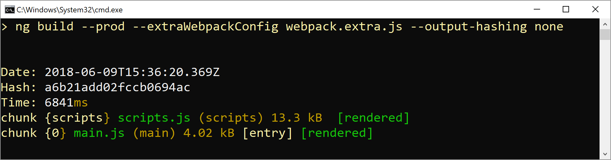

# ngx-build-plus

** This works with CLI 7.x; for CLI 8.x+ it is not updated b/c those versions come with a baked-in feature for differential loading **

Extend the Angular CLI's default build behavior without ejecting:

- 📄 Extend the default behavior by providing a **partial** config that just contains your additional settings
- 📄 Alternative: Extend the default behavior by providing a custom function
- 📦 Optional: Build a single bundle (e. g. for Angular Elements)
- ☑️ Inherits from the default builder, hence you have the same options
- 🍰 Simple to use 
- ⏏️ No eject needed

## Credits

Big thanks to [Rob Wormald](https://twitter.com/robwormald) and [David Herges](https://twitter.com/davidh_23)!

## Tested with CLI 6.x and CLI 7.0.x

This package has been created and tested with Angular CLI 6.x. and CLI 7.0.x. If the CLI's underlying API changes in future, I'll provide an respective update for this version too until the CLI has build-in features for the covered use cases.

## Breaking Change in Version 7

- The switch ``single-bundle`` now defaults to ``false`` to align with the CLI's default behavior.

## Example

https://github.com/manfredsteyer/ngx-build-plus

## Getting started

This shows a minimal example for getting started. It uses a minimal partial webpack configuration that is merged into the CLI's one. Representative for all possible custom webpack configurations, the used one just leverages the ``DefinePlugin`` to create a global ``VERSION`` constant during the build.

Please find the example shown here in the sample application in the folder ``projects/getting-started``.

1. Create a new Angular project with the CLI
2. Add ngx-build-plus: ``ng add ngx-build-plus``
   
   **Note:** If you want to add it to specific sub project in your ``projects`` folder, use the ``--project`` switch to point to it: ``ng add ngx-build-plus --project getting-started``
  
   **Remark:** This step installs the package via npm and updates your angular.json so that your project uses custom builders for ``ng serve`` and ``ng build``.
   
3. Add a file ``webpack.partial.js`` to the root of your (sub-)project:

    ```javascript
    const webpack = require('webpack');

    module.exports = {
        plugins: [
            new webpack.DefinePlugin({
                "VERSION": JSON.stringify("4711")
            })
        ]
    }
    ```
4. Use the global variable VERSION in your ``app.component.ts``:

    ```typescript
    import { Component } from '@angular/core';

    declare const VERSION: string;

    @Component({
    selector: 'app-root',
    templateUrl: './app.component.html',
    styleUrls: ['./app.component.css']
    })
    export class AppComponent {
    title = 'Version: ' + VERSION;
    }
    ```

5. Start your application with the ``--extra-webpack-config`` switch pointing to your partial webpack config:

    ```
    ng serve --extra-webpack-config webpack.partial.js -o
    ```

    If your project is a CLI based sub project, use the ``--project`` switch too:

    ```
    ng serve --project getting-started -o --extra-webpack-config webpack.partial.js
    ```

    **Hint**: Consider creating a npm script for this command.

6. Make sure that the VERSION provided by your webpack config is displayed.

## Using Plugins

Plugins allow you to provide some custom code that modifies your webpack configuration. In addition to that, they also provide a pre- and a post-hook for tasks that need to take happen before and after bundling. This is an example for an plugin:

```typescript
export default {
    pre() {
        console.debug('pre');
    },
    config(cfg) {
        console.debug('config');
        return cfg;
    },
    post() {
        console.debug('post');
    }
}
```

As this plugin is written with TypeScript you need to compile it.

The ``config`` method works like a ``configHook`` (see above).

To use a plugin, point to it's JavaScript representation (not the TypeScript file) using the ``--plugin`` switch:

```
ng build --plugin ~dist\out-tsc\hook\plugin
```

The prefix ``~`` points to the current directory. Without this prefix, ngx-build-plus assumes that the plugin is an installed ``node_module``.

## Using different merging strategies

You can also use plugins to implement different merging strategies. The following plugin demonstrates this:

```javascript
var merge = require('webpack-merge');
var webpack = require('webpack');

exports.default = {
    config: function(cfg) {
        const strategy = merge.strategy({
            'plugins': 'prepend'
        });

        return strategy (cfg, {
            plugins: [
                new webpack.DefinePlugin({
                    "VERSION": JSON.stringify("4711")
                })
            ]
        });
    }
}
```
To execute this, use the following command:

```
ng build --plugin ~my-plugin.js
```

One more time, the ``~`` tells ngx-build-plus that the plugin is not an installed node_module but a local file.

## Advanced example: Externals and Angular Elements

This shows another example for using ``ngx-build-plus``. It uses a custom webpack configuration to define some dependencies of an Angular Element as external which can be loaded separately into the browser and shared among several bundles.

*If you are not interested into this very use case, skip this section.*

The result of this description can be found in the [repository's](https://github.com/manfredsteyer/ngx-build-plus) ``sample`` directory.

1. Create a new Angular CLI based project and install ``@angular/elements`` as well as ``@webcomponents/custom-elements`` which provides needed polyfills:

    ```
    ng add @angular/elements 
    npm install @webcomponents/custom-elements --save
    ```

2. Expose a component as an Custom Element:

    ```TypeScript
    import { BrowserModule } from '@angular/platform-browser';
    import { NgModule, Injector } from '@angular/core';
    import { createCustomElement } from '@angular/elements';

    import { AppComponent } from './app.component';

    @NgModule({
        imports: [
            BrowserModule
        ],
        declarations: [
            AppComponent
        ],
        providers: [],
        bootstrap: [],
        entryComponents:[AppComponent]
    })
    export class AppModule { 

        constructor(private injector: Injector) {
        }

        ngDoBootstrap() {
            const elm = createCustomElement(AppComponent, { injector: this.injector });
            customElements.define('custom-element', elm);
        }

    }
    ```
3. Install ``ngx-build-plus``:

    When using Angular >= 7 and CLI >= 7, you can simply use ``ng add`` for installing ``ngx-build-plus``:

    ```
    ng add ngx-build-plus 
    ```

    If you are using a monorepo, mention the project you want to install ngx-build-plus for:

    ```
    ng add ngx-build-plus --project myProject
    ```

4. **Alternative**: *If, and only if,* this does not work for you, e. g. because you use an earlier Angular version, you can install the library manually:

    ```
    npm install ngx-build-plus --save-dev
    ```

    After this, update your angular.json:

    ```json
    [...]
    "architect": {
        "build": {
            "builder": "ngx-build-plus:build",
            [...]
        }
    }
    [...]
    ```

5. Create a file ``webpack.extra.js`` with a partial webpack config that tells webpack to exclude packages like ``@angular/core``:

    ```JavaScript
    module.exports = {
        "externals": {
            "rxjs": "rxjs",
            "@angular/core": "ng.core",
            "@angular/common": "ng.common",
            "@angular/platform-browser": "ng.platformBrowser",
            "@angular/elements": "ng.elements"
        }
    }
    ```

6. Build your application:

    ```
    ng build --prod --extraWebpackConfig webpack.extra.js --output-hashing none --single-bundle true
    ```

7. You will see that just one bundle (besides the ``script.js`` that could also be shared) is built. The size of the ``main.js`` tells you, that the mentioned packages have been excluded.

    

8. Copy the bundle into a project that references the UMD versions of all external libraries and your ``main.ts``. You can find such a project with all the necessary script files in the ``deploy`` folder of the sample.

    ```html
    <!doctype html>
    <html lang="en">
    <head>
    <meta charset="utf-8">
    <title>ElementsLoading</title>
    <base href="/">

    <meta name="viewport" content="width=device-width, initial-scale=1">
    <link rel="icon" type="image/x-icon" href="favicon.ico">
    </head>
    <body>

    <!-- Consider putting the following UMD (!) bundles -->
    <!-- into a big one -->

    <!-- core-js for legacy browsers -->
    <script src="./assets/core-js/core.js"></script>

    <!-- Zone.js -->
    <!-- 
        Consider excluding zone.js when creating
        custom Elements by using the noop zone.
    -->
    <script src="./assets/zone.js/zone.js"></script>


    <!-- Polyfills for Browsers supporting 
            Custom Elements. Needed b/c we downlevel
            to ES5. See: @webcomponents/custom-elements
    -->
    <script src="./assets/custom-elements/src/native-shim.js"></script>

    <!-- Polyfills for Browsers not supporting
            Custom Elements. See: @webcomponents/custom-elements
    -->
    <script src="./assets/custom-elements/custom-elements.min.js"></script>


    <!-- Rx -->
    <script src="./assets/rxjs/rxjs.umd.js"></script>

    <!-- Angular Packages -->
    <script src="./assets/core/bundles/core.umd.js"></script>
    <script src="./assets/common/bundles/common.umd.js"></script>
    <script src="./assets/platform-browser/bundles/platform-browser.umd.js"></script>
    <script src="./assets/elements/bundles/elements.umd.js"></script>

    <!-- Calling Custom Element -->
    <custom-element></custom-element>

    </body>
    </html>
    ```

9. Test your solution.

**Hint:** For production, consider using the minified versions of those bundles. They can be found in the ``node_modules`` folder after npm installing them.

**Hint:** The sample project contains a node script ``copy-bundles.js`` that copies the needed UMD bundles from the ``node_modules`` folder into the assets folder.

